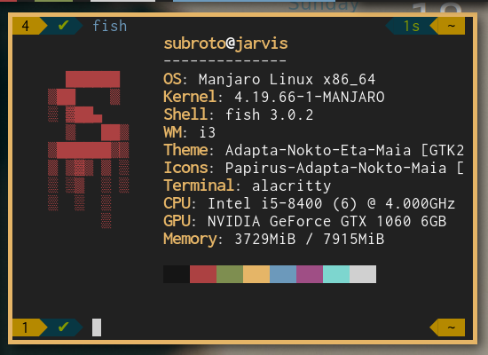

# Shub's Dotfiles

I have been troubling to setup Linux for a long time now. But recently Reddit has helped me a lot
and the subreddit [r/unixporn](https://www.reddit.com/r/unixporn/) has inspired me to upgrade my
Linux environment. I still have a long way to go for my setup to be complete, and totally fitting for
my personal use.



> This repo contains custom **fish-shell**, **i3** and many other confs for my persolnal setup

## Important Tools required:

> After Installing Manjaro, with i3wm as windows manager, some important tools
> are required for my setup (Arch is not used from scratch, as there are many setups and confs
> that manjaro handles by default).

* Polybar - replaced the default `i3bar` with polybar for better customizations
* Alacritty - I was using `URxvt` for starters for my Terminal, it's quite light weight,
 but lacks support for dynamic glyph widths, where alacritty is great. Also Alacritty is GPU
 accelerated, which makes it the future of Terminals.
* Rofi - Program runner
* Nerd Fonts - Patched fonts to get handled by powerline shells.
*


## Dotfiles Setup:
### File Structure and Usages:
- `.vim` directory has a `vimrc` file, just creating a soft link to this repo's `.vim` file in your home directory would make it work.
- There is a `.zshrc` file which you can create a symlink for in your home directory.
	- Theme used for terminal is a customized version of [Cobalt2-iterm](https://github.com/wesbos/Cobalt2-iterm).
	- Colorscheme used for terminal is `AfterGlow`, [All OMZ themes](https://github.com/mbadolato/iTerm2-Color-Schemes)
	- Set Font Style to [FiraCode](https://github.com/tonsky/FiraCode), also enable _font-ligatures_ in iterm2 for MacOSX.
	- Use `Plug Install` to install all the Plugins for `vim`.
- `git_template` directory has the hooks for ctags, i.e. post_commit, post_checkout etc. Create symlink in your home directory to this directory.
- Setting up ctags for vim:
```
$ brew install ctags
$ ctags -R -f ./.git/tags .
```
- Other few `*.json`, `*.cson` files are Editor Specific Configuration Files...

> Note: Above Steps define how the Dotfiles Files are
> maintained and work, but to make the Setup Automated, run
> the provided `init_script.sh`.

## Network Driver Issues:

Wireless Network for Broadcom _14e4:4365_, is not supported by default by, Linux Mint/Ubuntu
To get a workaround for this, I went to this [site](https://askubuntu.com/questions/459654/drivers-for-broadcom-bcm43142-on-ubuntu-14-04-trusty-tahr)

__*Solution*__:
Using Synaptics Manager Install `bcmwl-kernel-source`, for wireless network...

## Initial Installs:

#### Important Repos:

> **NOTE**: There is no need to install Powerline Fonts
> now. Use FiraCode Font for the System, which by default
> enables Powerline Patched Fonts, and is great.

* [Awesome Terminal Fonts](https://github.com/gabrielelana/awesome-terminal-fonts)
	- Can be used for Modifying various terminal related fonts, to look better...
* [OH MY ZSH](https://github.com/arialdomartini/oh-my-git)
	repo is great for beautifuly setting up the ZSH Terminal.

### Command Line:

* Java 1.8 (JRE & JDK) -> [How To Install](http://www.webupd8.org/2012/09/install-oracle-java-8-in-ubuntu-via-ppa.html)

> NOTE: Eclipse Works with Java v1.8 only...

* Mysql -> Using Synaptics
	- Also Installing Mysql Shell for Batch Programming...
* Git
- Docker -> [Installation](https://docs.docker.com/engine/installation/linux/docker-ce/ubuntu/#os-requirements)
* Redshift
	- Create a Config file from [Official Page](http://jonls.dk/redshift/)
	- Check these [dependencies](https://askubuntu.com/questions/482373/how-do-i-install-redshift-in-ubuntu), and install
	them using Synaptics...
	- `redshift -c ~/.config/redshift.conf` to run the redshift
	- Also in configuration, To setup for Multiple Displays, checkout [this issue](https://github.com/jonls/redshift/issues/23#issuecomment-228368667). It describes to use xrandr for finding the number for primary screen...
* Vim
* Sublime Text
* Atom Text Editor - [Site](https://github.com/atom/atom/releases/)
* Visual Studio COde
* NodeJS - [Site](https://nodejs.org/en/download/package-manager/#debian-and-ubuntu-based-linux-distributions)

### Softwares

* Eclipse (installer)
* DBeaver (Installer)
	- Change the dbeaver.ini file in `/usr/share/dbeaver` or in installed directory and change `--launcher.GTK_version` to 3
* MongoDB


### Setups

* Generate SSH Key for Git
	- Use Public Key for SSH for Gitlab
	- Setup SSH Config for other remotes, [How To](https://www.digitalocean.com/community/tutorials/how-to-configure-custom-connection-options-for-your-ssh-client)
* Install PowerLine Fonts, before proceeding... Better use FiraCode,
  a much better Font for Development, also if used, enable Font Ligatures...

```shell
cd
wget https://github.com/powerline/powerline/raw/develop/font/PowerlineSymbols.otf
wget https://github.com/powerline/powerline/raw/develop/font/10-powerline-symbols.conf
mv PowerlineSymbols.otf ~/.fonts/
mkdir -p ~/.config/fontconfig/conf.d #if directory doesn't exists

# Clean Font Cache...
fc-cache -vf ~/.fonts/

# Move config file
mv 10-powerline-symbols.conf ~/.config/fontconfig/conf.d/
```
* Teminal Setup:
	- [Silver Searcher](https://github.com/ggreer/the_silver_searcher)
	- [Fuzzy Search](https://github.com/junegunn/fzf)

* Setting Eclipse Color Themes
	- Make theme to Dark
	- Download __Eclipse Color Theme__ for Eclipse and Set the Syntax to Monokai __OR INSTALL Darkest Dark Theme__
	- For handling Eclipse Tabs, use .desktop to run following __NOTE: Can also be used with DBeaver__
	_Exec=env SWT_GTK3=0 GTK2_RC_FILES=<DIR>/.gtkrc-eclipse <DIR>/eclipse-jee-neon/eclipse_, [LINK](https://github.com/KiranMohan/eclipse-gtk3-ubuntu)
	Where `.gtkrc-eclipse` can be found [here](https://gist.github.com/andrioli/3825078)...

* Clone Docker Project from My Personal Repo, to start Hazelcast and AMQ with latest conf
* Git Setup
	- git config --global http.sslverify false (For Making HTTP Protocol work for cloning and stuff)
	- For SSH Cloning, I need to create a new Key file, whose config should be set like this
	- Also do remember to add the ssh key to registery

```shell
# Start the ssh-agent in the background.
eval "$(ssh-agent -s)"

# Register the Key...
ssh-add ~/.ssh/id_rsa

```

* Firefox Optimization for RAM:
	- Disable MultiProcess in Firefox
	- Enable Performance in Preferences -> General Tab, with `1` as Default.
	- Try to Remove most of the Plugins and Extensions used...
	- `browser.tabs.remote.autostart`, make it false

## Needs to be Done

* ~~Change PS1 for Terminal~~
	- Install _oh-my-zsh_, and Patched PowerLine Fonts from [Site](https://github.com/Lokaltog/powerline-fonts).
* ~~Need to Make DBeaver Eclipse UI support small tabs...~~
